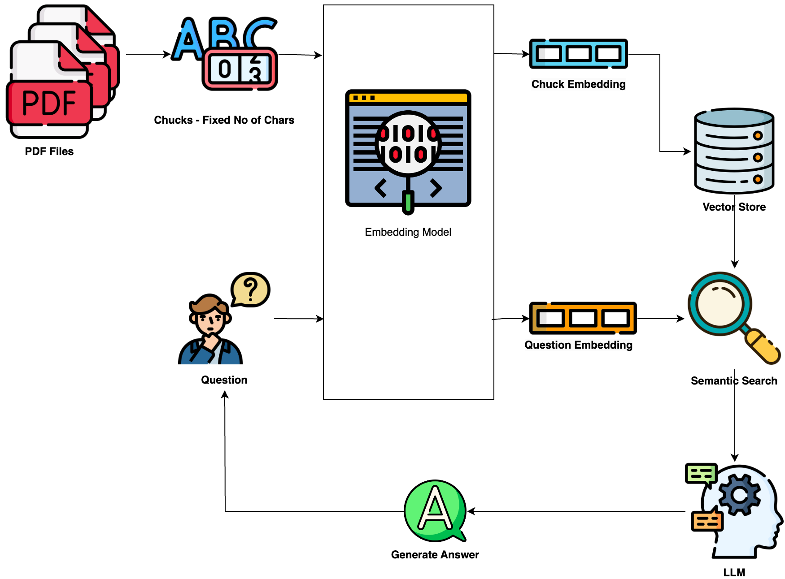

### QA Bot: A PDF QA Assistant

The main objective of this notebook is to demonstrate how to use the LLM to create the QA bot for PDF files. The process can break into a number of steps:
1. Data Preprocessing - PDF files are processed to extract their textual content
2. Content Chunking - The text content is divided into fixed-size chunks of 512 tokens, overlapping 100 tokens. 
3. Embeddings Generation - Each content chunk is transformed into embeddings using ```e5-base-b2``` model. (Any other suitable model can be used here)
4. Building the QA bot: ```google/flan-t5-large``` LLM model was selected for this task.



### How to Run
1) Git clone this repo
2) Install related packages ```pip3 install -r requirements.txt```
3) Start jupyter notebook ```jupyter notebook```
4) Click ```demo.ipynb```  and run all cells.


